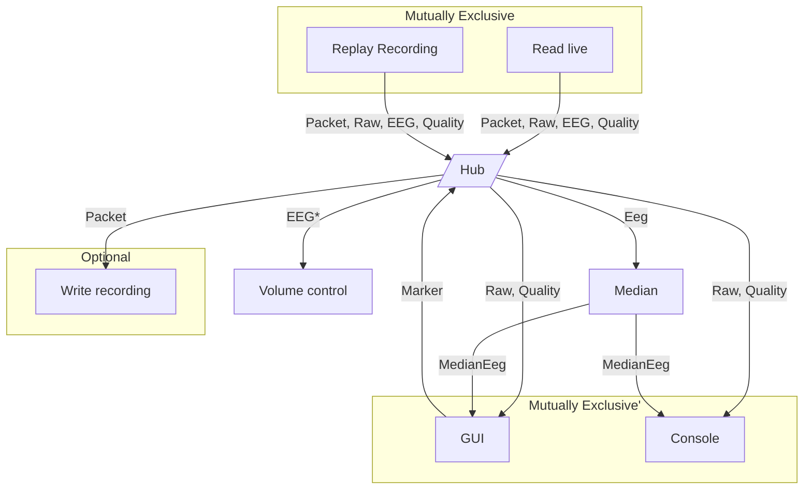

# Architecture

## Actors

Actors are the main building blocks of the application. They are responsible for processing data and producing side effects such visual output, change of volume, etc.

Actors are run in separate threads and communicate with each other using channels that are managed by a `Hub`.
Any actor can subscribe to any channel and any actor can publish to any channel.

Actors are coordindated such that if one actor stops, all other actors stop too.

## Data flow

